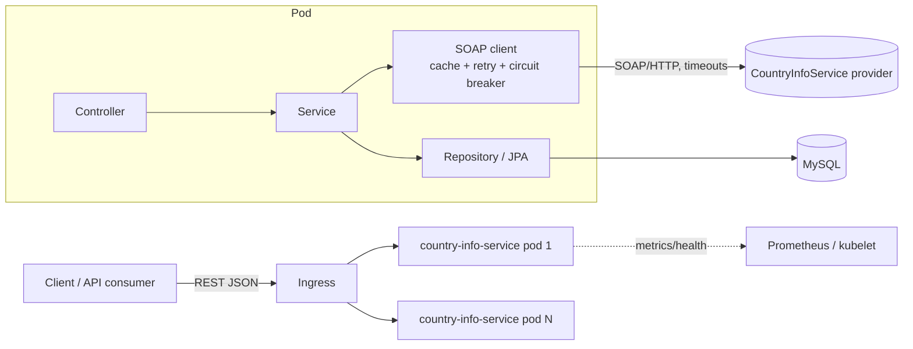

# Design

## Component view

## Layering (MVC + ports)

| Layer | Package | Responsibility |
|---|---|---|
| Controller | `controller` | HTTP only: validation, status codes, URIs |
| Service | `service` | Business flow, transaction boundaries |
| Integration | `client` | SOAP envelope/parse + all resilience for the provider |
| Persistence | `repository`, `model` | JPA entities `CountryInfo` 1-* `Language` |
| API model | `dto`, `mapper` | Entities never leave the service layer |
| Cross-cutting | `exception`, `web`, `config` | Error mapping, correlation id, properties |

## Integration pattern

Synchronous **request/response orchestration** behind a REST façade, with an **anti-corruption adapter** (`SoapCountryClient`)
so SOAP/XML details never leak into the domain. Two chained SOAP calls (name -> ISO code -> full info) are orchestrated by the service.
Result is persisted as an **idempotent upsert keyed by ISO code**: repeating the POST refreshes rather than duplicates.

## Designed for high load

- **Stateless pods**: no session or local state; scale with the HPA (CPU 70%, 2-6 replicas), PDB keeps >=1 pod during node drains.
- **Caching** (Caffeine, 1 h TTL, 500 entries): name->ISO and ISO->info rarely change, so repeat lookups never hit the provider.
- **Short transactions**: SOAP calls run *outside* the DB transaction; no DB connection is held while waiting on a remote system.
- **Bounded resources**: Hikari pool size, JVM sized from the container limit, timeouts on every remote call.
- **Pagination** on list, `default_batch_fetch_size` to avoid N+1 on languages.
- **Graceful shutdown + preStop** so rolling updates drop no requests.

## Failure handling

| Mechanism | Setting | Why |
|---|---|---|
| Timeouts | connect 3 s, read 10 s | A slow provider cannot exhaust threads |
| Retry | 3 attempts, 500 ms x2 back-off, only on technical errors | Rides out blips; never retries "country not found" |
| Circuit breaker | 50% failures over 10 calls opens for 30 s, 3 probe calls | Fail fast, give the provider room to recover |
| Fallback | `ExternalServiceUnavailableException` -> **503 + Retry-After** | Clear, user-friendly signal instead of a stack trace |
| Readiness | DB included, SOAP provider **not** | A provider outage must not take every pod out of rotation |

## Observability

- **Logs**: one access line per request, SOAP call timing, business events; all carry `correlationId` (MDC). `prod` profile emits JSON (ECS).
- **Metrics**: Micrometer -> `/actuator/prometheus` (JVM, HTTP, Hikari, Resilience4j circuit breaker, `soap.client.requests{operation,outcome}`).
- **Health**: liveness / readiness / startup probes; circuit-breaker state in `/actuator/health`.

## Key decisions and trade-offs

| Decision | Alternative | Trade-off |
|---|---|---|
| Hand-built SOAP envelopes + DOM parsing | WSDL -> JAXB codegen / Spring-WS | No build-time network or generated code and small footprint; but no compile-time contract check. Switch to codegen if the SOAP surface grows. |
| In-process Caffeine cache | Redis | Zero infrastructure; each pod warms its own cache and entries can differ for up to 1 h. Use Redis if pods must share cache or data is volatile. |
| Synchronous flow | Queue (Kafka/RabbitMQ) + async worker | Simple, immediate answer. If provider latency or volume grows, accept the request with 202 and process via a queue. |
| `ddl-auto=update` | Flyway migrations | Fastest to run for the exercise; production should use versioned migrations and `validate`. |
| MySQL as a single StatefulSet | Managed/HA database | Self-contained demo; a single replica is a SPOF. |
| Sentence case exactly as specified ("South africa") | Title case | Matches the requirement; if the provider is case-sensitive for multi-word names, change `TextUtils`. |
| Upsert on ISO code | Always insert | Idempotent and no duplicates; a concurrent duplicate POST can hit the unique key and returns 409. |
